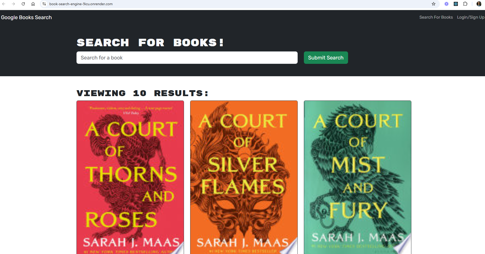
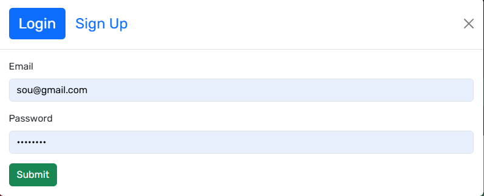
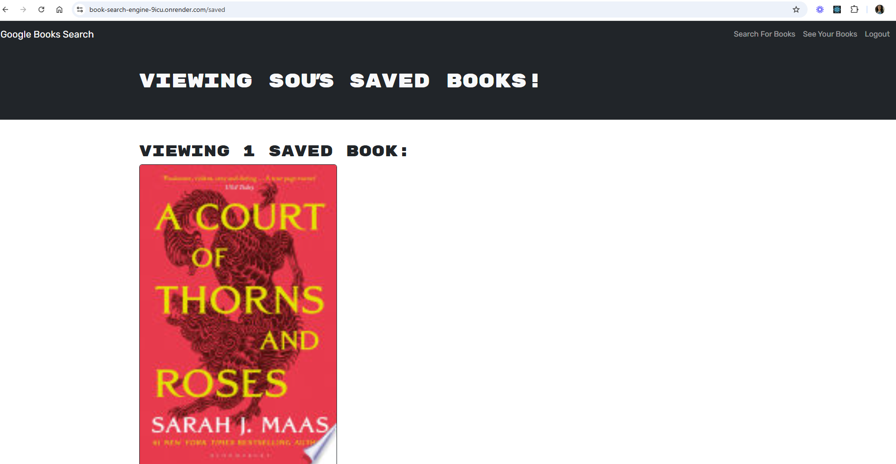

# **Book Search Engine**


---

# Table of Contents

- [**Project Description**](#project-description)
- [**Screenshots**](#screenshots)
- [**Technologies Used**](#technologies-used)
- [**Setup and Installation**](#setup-and-installation)
- [**Demonstration**](#demonstration)
- [**Questions**](#questions)
- [**License**](#license)

---

## **Project Description**

Book Search Engine is a full-stack MERN application that allows users to search for books using the Google Books API, save their favorite books, and manage them within their accounts. Users can sign up, log in, and view a personalized list of saved books, which includes features like adding or removing books from their collection.

---

## **Screenshots**

- **Search for books**:
  

- **Login/Signup**:

  

- **Saved books**:
  

---

## **Technologies Used**

- **FrontEnd**: React.js, Bootstrap
- **Backend**: Node.js, Express.js
- **GraphQL**: Apollo Server, GraphQL Queries and Mutations
- **Database**: MongoDB, Mongoose ORM
- **Authentication**: JWT
- **API Integration**: Google Books API

---

## **Setup and Installation**

Follow these steps to get the application running on your local machine:

1. **Clone the Repository**

   ```bash
    git clone <repository-url>
    cd book-search-engine
   ```

2. **Install Dependencies**

   ```bash
   npm install
   ```

3. **Access the App**

   Setup the environment variables

   ```bash
    MONGO_URI=<your-mongodb-connection-string>
    JWT_SECRET=<your-secret-key>
    ```

4. **Run the application**

    ```bash
    npm run develop
    ````

---

## **Demonstration**

Click on this [Link](https://book-search-engine-9icu.onrender.com/) to see the live demo for this app!

## **Questions**

For any questions please reach out by email, and feel free to check my github:

<table>
  <tr>
    <td align="center">
      <a href="https://github.com/souad-hb">
        
        <br />
        <sub><b>Souad</b></sub>
      </a>
      <br />
      <a href="mailto:souadsalahh@gmail.com">souadsalahh@gmail.com</a>
    </td>
  </tr>
</table>

---

## **License**

This project is licensed under the [MIT License](https://opensource.org/licenses/MIT).
